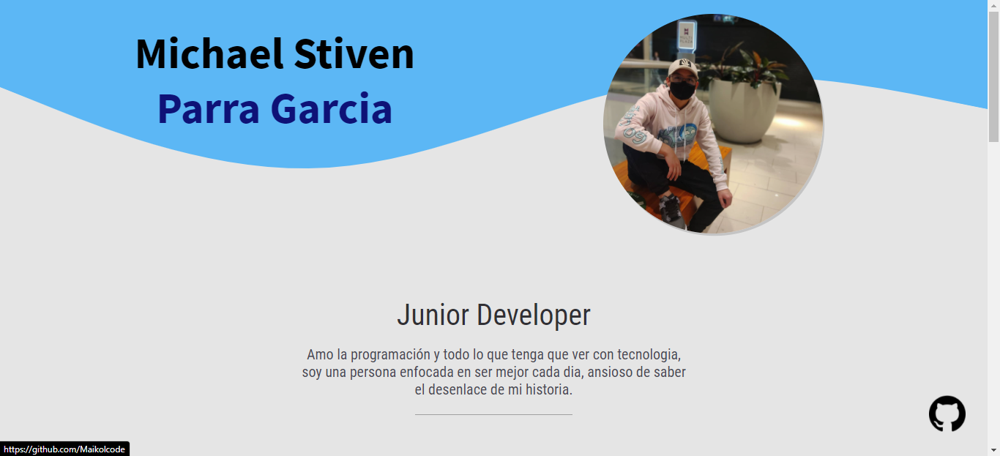

<h1>Portafolio Web</h1>

<b>Bienvenido</b>, este es un pequeño proyecto donde voy a plasmar a mi manera una hoja de vida o curriculum vitae en un entorno de web, dando a conocer mis objetivos y mi ruta de aprendizaje.

<h2>Como lo hice? :rocket:</h2>

Para la elaboracion de la pagina utilice 3 lenguajes muy importantes en el desarrollo web, los cuales son:

- HTML :sparkler:
- CSS :balloon:
- JS :crystal_ball:

Apoyandome con algunas librerias de Java Script para mejorar el diseño.

- <a href="https://atomiks.github.io/tippyjs/">TippyJs</a> -> creación de tooltips personalizados 
- <a href="https://scrollrevealjs.org/">ScrollReveall</a> -> animaciones al scrollear en la pagina

<h2>Demo funcional :ok_hand:</h2>

Si quieres revisarla en la web dale click <a href="https://michaelparra.netlify.app/">aqui</a> :point_left: